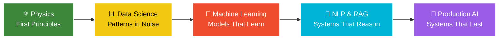

<!-- Animated Wave Header -->

<!-- Typing Effect -->

  

<!-- Profile Stats -->

  
  
  
  
  

<!-- Social Links -->

  &nbsp;
  &nbsp;
  &nbsp;
  &nbsp;
  &nbsp;
  

<!-- Gradient Divider -->

## 👨‍💻 About Me

Hi, I'm **Oussama** — an AI engineering student who got here the long way around, through **physics**.

Before neural networks, there were plasma equations and quantum states. Studying physics — including a final-year project on **nuclear fusion by inertial confinement** — taught me something no framework can: how to reason from first principles, distrust any number I haven't measured, and stay calm in front of a problem nobody has solved yet.

Today I point that same instinct at AI. I don't just want a model that works — I want to know **why** it works, where it breaks, and whether it will hold up when real users and real data hit it. That's the difference between a demo and a system, and it's the kind of work I care about.

Right now I'm building **production AI and automation** at Circet Morocco, writing my engineering thesis, and shipping side projects that turn messy, human problems — documents, data, broken workflows — into systems that reason reliably.

 

### 🧭 The journey so far

### 🎯 Quick Highlights

<table>
  <tr>
    <td>🎓 <b>Education</b></td>
    <td>State Engineer's Degree in AI (ENIAD) • Bachelor in Physics</td>
  </tr>
  <tr>
    <td>💼 <b>Current Role</b></td>
    <td>AI Engineer PFE Intern @ Circet Morocco • Power Automate ALM Framework</td>
  </tr>
  <tr>
    <td>🌱 <b>Learning</b></td>
    <td>Advanced NLP • MLOps • RAG Architecture • Agentic Systems</td>
  </tr>
  <tr>
    <td>🔭 <b>Open To</b></td>
    <td>End-of-Study & Entry-Level Roles • AI/ML Projects • Research Collaborations</td>
  </tr>
  <tr>
    <td>⚡ <b>Unique Edge</b></td>
    <td>A physicist's instinct for first principles, applied to building AI</td>
  </tr>
  <tr>
    <td>🌍 <b>Languages</b></td>
    <td>Arabic (Native) • English (B2) • French (B1)</td>
  </tr>
  <tr>
    <td>📞 <b>Contact</b></td>
    <td>+212 634960373 • oussousselhadji@gmail.com</td>
  </tr>
</table>

<!-- Gradient Divider -->

## 💼 Professional Experience

<b>⚡ AI Engineer Intern (PFE) • Circet Morocco &nbsp;🟢 Current</b>

 

📅 **March 2026 – Present** | 📍 Casablanca, Morocco

**The mission:** bring real software-engineering discipline to Power Automate — a low-code world that usually has none. I'm designing an **Application Lifecycle Management (ALM) framework** from the ground up.

**What I'm building:**
- A full **DEV → TEST → PROD** pipeline for Power Automate flows, with proper environment separation
- Automated **CI/CD** on GitLab + **PowerShell** scripts for packaged, repeatable deployments
- A centralized **FlowLogger** layer streaming run-level telemetry into SharePoint — turning invisible flows into something you can actually observe and debug
- An **AI component** (Claude API) that reads failures and explains them in plain language, plus anomaly detection
- A **Power BI** dashboard for real-time flow health, and a **Teams bot** for live incident alerts

**Tech Stack:** Power Automate • GitLab CI/CD • PowerShell • SharePoint • Power BI • Microsoft Teams • Claude API • Power Platform CLI

<b>🏦 AI Engineering Intern • CDG Capital</b>

 

📅 **Jul 2025 – Sep 2025** | 📍 Rabat, Morocco (Hybrid)

**Project:** Intelligent agent for regulatory compliance analysis.

**What I did:**
- Built an NLP system that reads dense financial regulations (OPCI, securitization) and extracts the rules that matter
- Automated the generation of **control plans** straight from regulatory documents — work that used to be entirely manual
- Worked alongside a multidisciplinary AI and engineering team in a real enterprise setting

**Tech Stack:** Python • NLP • Machine Learning • Document Processing • Compliance Automation

**GitHub:** [CDG-CAPITAL-FINANCE](https://github.com/CDG-CAPITAL-FINANCE/)

<b>🤖 AI Developer Intern • Teknologiate</b>

 

📅 **Jul 2025** | 📍 Casablanca, Morocco (Remote)

**Project:** AI avatar for a recruitment platform.

**What I did:**
- Designed and implemented an intelligent AI avatar for HR processes
- Supported automated interview and candidate-selection systems
- Integrated ML models into a real-world recruitment environment to make screening faster and fairer

**Tech Stack:** Python • AI/ML • NLP • HR Technology

<b>📊 Machine Learning Intern • Prodigy InfoTech</b>

 

📅 **Nov 2024 – Dec 2024** | 📍 Remote

**Project:** Cardiovascular disease prediction system.

**What I did:**
- Built and compared supervised models (Logistic Regression, SVM, Decision Trees)
- Designed the preprocessing and feature-engineering pipelines
- Reached **92%+ accuracy** and shipped weekly documentation on schedule

**Certification:** PIT/NOV24/20689

**Tech Stack:** Python • Scikit-learn • Pandas • NumPy • Data Analysis

<b>🏋️ Sport Leader • Decathlon Morocco</b>

 

📅 **Aug 2024 – Oct 2024** | 📍 Oujda, Morocco (On-site)

Not an engineering role — but where I learned to read people, work a floor, and stay sharp under pressure.

- Managed customer relations and sports-product consultation
- Handled inventory control and merchandising
- Ran sports workshops and safety training

**Skills:** Customer Service • Logistics • Team Leadership • Communication

<b>🤝 National Volunteer • Ministry of Youth, Culture & Communication</b>

 

📅 **Aug 2023** | 📍 Nador – Selouane, Morocco

**Program:** National Volunteer Program "Motatawi3" (21-day intensive)

- Social, cultural, and personal-development initiatives
- Community engagement and event organization
- Cultural-event logistics support

<b>💻 Intern • ELEAT Center</b>

 

📅 **May 2023 – Jul 2023** | 📍 Oujda, Morocco

**Training:** Microsoft Office Suite — professional development.

**Skills Acquired:** Word • Excel • PowerPoint • Document Management

<!-- Gradient Divider -->

## 🛠️ Tech Stack & Expertise

### 💻 Programming Languages

### 🤖 AI / ML & Data Science

### 🧠 NLP & GenAI

### 🌐 Web & Backend

### 📊 BI & Data Engineering

### ⚙️ DevOps & Tooling

<!-- Gradient Divider -->

## 🚀 Featured Projects

> The thread connecting them all: take something messy and human — documents, data, broken workflows — and make a system reason about it reliably.

<table>
  <tr>
    <td width="50%" valign="top">

### 🤖 [ENIAD Educational Chatbot](https://github.com/ennajari/ENIAD-ASSISTANT)

  
  

A multilingual campus assistant that doesn't just retrieve — it **understands**. Pairs a **RAG** pipeline with a **fine-tuned Llama 3**, so answers are both grounded and fluent.

- RAG with a Qdrant vector database
- Fine-tuned Llama 3 (Q-LoRA)
- French / English support
- FastAPI backend + React frontend

</td>
<td width="50%" valign="top">

### 🤝 [Multi-Agent Data Analytics](https://github.com/chakorabdellatif/Multi-Agent_System_CrewAI_Automate-Analyzing_Products_Dataset)

  
  

A **crew of AI agents** that hands itself a dataset, explores it, runs the statistics, and writes up the findings — no human in the loop.

- Autonomous data exploration
- Multi-agent collaboration (CrewAI)
- Statistical analysis & reporting
- Automated visualization

</td>
  </tr>
  <tr>
    <td width="50%" valign="top">

### 🏦 [Regulatory Compliance Agent](https://github.com/CDG-CAPITAL-FINANCE/)

  
  

Reads dense financial regulation (OPCI, securitization) the way an analyst would — then writes the **control plan** for you.

- NLP-based document processing
- Automated compliance-rule extraction
- Control-plan generation
- Built in a real enterprise setting

</td>
<td width="50%" valign="top">

### ❤️ [Stroke Risk Prediction](https://github.com/Bosaj/Stroke-Prediction-Project)

  
  

A careful, comparative ML study on cardiovascular stroke risk — the kind of work where getting the evaluation right matters more than the headline number.

- LogReg, SVM, Random Forests
- ~92% accuracy with full EDA
- Honest model comparison

Team: ELHADJI • BAHAYA • GUAFFARI • SADOG · Supervisor: Dr. Asmae Bentaleb

</td>
  </tr>
  <tr>
    <td width="50%" valign="top">

### 📊 [Vehicle Trade BI](https://www.kaggle.com/datasets/techsalerator/importexport-trade-data-in-morocco)

  
  

An end-to-end BI pipeline on Morocco's vehicle import/export data — from raw rows to a dashboard a decision-maker can actually use.

- MySQL data-warehouse design
- Talend ETL pipeline
- Interactive Power BI dashboard

</td>
<td width="50%" valign="top">

### ⚛️ Nuclear Fusion Research

  
  

Where the first-principles thinking started: a final-year analysis of **nuclear fusion by inertial confinement**.

- Inertial Confinement Fusion (ICF)
- Plasma physics & energy transfer
- Advanced physics modeling

</td>
  </tr>
</table>

<!-- Gradient Divider -->

## 📊 GitHub Analytics

<!-- Gradient Divider -->

## 🎓 Education

<table>
  <tr>
    <th>📅 Period</th>
    <th>🎯 Degree</th>
    <th>🏛️ Institution</th>
    <th>🏆 Achievement</th>
  </tr>
  <tr>
    <td>Dec 2023 – Present</td>
    <td><b>State Engineer's Degree in Artificial Intelligence</b></td>
    <td>ENIAD — Mohammed First University</td>
    <td>In Progress</td>
  </tr>
  <tr>
    <td>Sep 2022 – Present</td>
    <td><b>Bachelor's Degree in Physical Sciences</b></td>
    <td>Faculty of Sciences — Mohammed First University</td>
    <td>In Progress</td>
  </tr>
  <tr>
    <td>Sep 2019 – Feb 2022</td>
    <td><b>DEUG in Physical Sciences</b></td>
    <td>Faculty of Sciences — Mohammed First University</td>
    <td>⭐ <b>Honors</b></td>
  </tr>
  <tr>
    <td>Sep 2017 – Jul 2019</td>
    <td><b>Baccalaureate in Physical Sciences</b></td>
    <td>Zineb Ennafzaouia High School, Oujda</td>
    <td>⭐ <b>Honors</b></td>
  </tr>
</table>

<!-- Gradient Divider -->

## 🏆 Certifications

<table>
  <tr>
    <th>📜 Certification</th>
    <th>🏢 Provider</th>
    <th>📅 Date</th>
    <th>🔑 Credential ID</th>
  </tr>
  <tr>
    <td><b>Data Science Fundamentals with Python and SQL</b></td>
    <td></td>
    <td>Oct 2025</td>
    <td><code>7NO5QXMVDTS1</code></td>
  </tr>
  <tr>
    <td><b>Google Data Analytics Professional Certificate</b></td>
    <td></td>
    <td>Oct 2025</td>
    <td><code>E5EZMU8R0DRZ</code></td>
  </tr>
  <tr>
    <td><b>Generative AI: Prompt Engineering Basics</b></td>
    <td></td>
    <td>Apr 2025</td>
    <td><code>8JVS8LHEI0AX</code></td>
  </tr>
  <tr>
    <td><b>Machine Learning Internship Certificate</b></td>
    <td></td>
    <td>Dec 2024</td>
    <td><code>PIT/NOV24/20689</code></td>
  </tr>
  <tr>
    <td><b>Career Essentials in Generative AI</b></td>
    <td></td>
    <td>Apr 2024</td>
    <td>Verified ✅</td>
  </tr>
  <tr>
    <td><b>MIATHON 2nd Edition</b></td>
    <td></td>
    <td>Jul 2024</td>
    <td>Verified ✅</td>
  </tr>
</table>

<!-- Gradient Divider -->

## 🌍 Community & Volunteering

Engineering is what I do; **showing up for people** is who I am.

- **Management Team** · Club Motatawi3 El-Alfia — *Apr 2024 – Present* · Activity organization & event logistics
- **Coordinator** · Good Ambassadors Association, Oujda — *Sep 2023 – Present* · Community development & volunteer supervision
- **Humanitarian Coordinator** · Marrakech Earthquake Relief — *Sep 2023* · Organized and delivered donations to affected areas
- **Awareness Coordinator** · Regional Blood Transfusion Center (CRTS), Oujda — *Aug 2023* · Led blood-donation campaigns
- **Volunteer** · Ministry of Youth, Culture & Communication — *Aug 2023* · Cultural & social event support

<!-- Gradient Divider -->

## 🎯 Beyond the Code

I think better when I step away from the screen.

🥋 **Taekwondo** — discipline and patience, one belt at a time
🏋️ **Weightlifting** — the same compounding-progress mindset I bring to learning
📸 **Photography** — I see the world in frames → [@catcher_sama](https://instagram.com/catcher_sama)
🎬 **Content Creation** — visual storytelling and video editing

<!-- Gradient Divider -->

## 📬 Let's Build Something

I'm currently open to **end-of-study and entry-level AI engineering roles**, research collaborations, and interesting open-source work. If any of the above resonates, the door's open.

  
  
  

<table>
  <tr><td align="center"><b>📍 Based in</b></td><td>Casablanca / Oujda, Morocco 🇲🇦 · GMT+1</td></tr>
  <tr><td align="center"><b>📞 Phone</b></td><td>+212 634960373</td></tr>
  <tr><td align="center"><b>🌍 Languages</b></td><td>Arabic (Native) · English (B2) · French (B1)</td></tr>
</table>

 

⭐ *If something here caught your eye, a star on my repos means a lot.*

*Built in Morocco 🇲🇦 — reasoning from first principles, one system at a time.*

