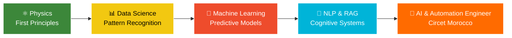

<!-- Animated Wave Header -->

<!-- Typing Effect -->

  

<!-- Profile Badges -->

  
  
  
  
  

<!-- Social Links -->

  &nbsp;
  &nbsp;
  &nbsp;
  &nbsp;
  &nbsp;
  

<!-- Gradient Divider -->

## 👤 About Me

Hi, I'm **Oussama EL HADJI** — an **AI & Automation Engineer at Circet Morocco**.

My engineering foundation was built through **physics**. Before neural networks and generative AI, I worked with plasma equations and quantum mechanics. My academic physics background — including research in **Inertial Confinement Fusion (ICF)** — taught me to reason from first principles, rigorously validate data, and approach unsolved problems with extreme discipline.

Today, I apply that mindset to **enterprise AI engineering, intelligent automation, NLP, and MLOps**. Having recently completed my 6-month PFE engineering internship at **Circet Morocco** (March – August 2026), I officially transitioned into a full-time **AI & Automation Engineer** role starting **September 01, 2026**, designing production ALM frameworks, intelligent agent workflows, and AI automation pipelines.

 

### 🛣️ The Journey

### 📌 Quick Highlights

<table>
  <tr>
    <td>🏢 <b>Current Role</b></td>
    <td><b>AI & Automation Engineer @ Circet Morocco</b> (Full-time, Sep 01, 2026 – Present)</td>
  </tr>
  <tr>
    <td>🎓 <b>Education</b></td>
    <td><b>State Engineer's Degree in Artificial Intelligence</b> — ENIAD (Very Good Honors) 🎓</td>
  </tr>
  <tr>
    <td>💼 <b>PFE Internship</b></td>
    <td>AI & Automation Engineering Intern @ Circet Morocco (March 04 – August 31, 2026)</td>
  </tr>
  <tr>
    <td>🚀 <b>Core Specializations</b></td>
    <td>Enterprise AI, Agentic Workflows, Power Automate ALM, RAG Architecture, Computer Vision</td>
  </tr>
  <tr>
    <td>⚡ <b>Engineering Edge</b></td>
    <td>First-principles reasoning from physics applied to scalable, fault-tolerant AI production systems</td>
  </tr>
  <tr>
    <td>🗣️ <b>Languages</b></td>
    <td>Arabic (Native) 🇲🇦 • English (B2) 🇬🇧 • French (B1) 🇫🇷</td>
  </tr>
  <tr>
    <td>📫 <b>Contact</b></td>
    <td>+212 634960373 • <a href="mailto:oussousselhadji@gmail.com">oussousselhadji@gmail.com</a></td>
  </tr>
</table>

<!-- Gradient Divider -->

## 💼 Professional Experience

<b>🤖 AI & Automation Engineer • Circet Morocco</b> &nbsp;<g-emoji class="g-emoji" alias="star" fallback-src="https://github.githubassets.com/images/icons/emoji/unicode/2b50.png">⭐</g-emoji> <i>Current Role</i>

 

📅 **September 01, 2026 – Present** | 📍 Casablanca, Morocco (On-site / Hybrid)

**Scope & Responsibilities:**
- Transitioned into full-time **AI & Automation Engineer** following successful completion of PFE graduation project.
- Leading enterprise-wide **AI Integration & Intelligent Automation** initiatives across telecom and network infrastructure operations.
- Engineering end-to-end **Application Lifecycle Management (ALM)** pipelines for low-code automation workflows.
- Architecting custom LLM integrations (Claude API, OpenAI) for automated failure diagnostics, root-cause analysis, and incident response.

**Tech Stack:** Power Automate • GitLab CI/CD • PowerShell • Python • LLM APIs • SharePoint • Power BI • Microsoft Teams

<b>🎓 AI & Automation Engineering Intern (PFE) • Circet Morocco</b>

 

📅 **March 04, 2026 – August 31, 2026** (6 Months) | 📍 Casablanca, Morocco

**Project:** Enterprise Application Lifecycle Management (ALM) Framework & AI Monitoring for Low-Code Workflows.

**Key Achievements & Deliverables:**
- Designed and engineered a complete **DEV ➔ TEST ➔ PROD** ALM pipeline for Power Automate flows with strict environment isolation.
- Built automated **CI/CD** pipelines on GitLab coupled with robust **PowerShell** deployment scripts for package management.
- Implemented a centralized **FlowLogger** telemetry layer streaming execution metrics into SharePoint for real-time observability.
- Integrated an **AI Diagnostic Engine** (Claude API) to analyze flow execution logs, explain errors in natural language, and flag anomalies.
- Deployed a **Power BI** executive health dashboard and automated **Teams bot** for real-time incident alerting.

**Tech Stack:** Power Automate • GitLab CI/CD • PowerShell • SharePoint • Power BI • Teams Bot • Claude API • Power Platform CLI

<b>🏦 AI Engineering Intern • CDG Capital</b>

 

📅 **July 2025 – September 2025** | 📍 Rabat, Morocco (Hybrid)

**Project:** Intelligent NLP Agent for Regulatory Compliance Analysis & Control Plans.

**Key Achievements:**
- Engineered an NLP system to ingest complex legal/financial regulations (OPCI, securitization) and extract key compliance mandates.
- Automated the generation of structured **Control Plans** directly from regulatory PDF documents, eliminating manual audit effort.
- Collaborated in a cross-functional AI & banking analytics team in an enterprise environment.

**Tech Stack:** Python • NLP • Machine Learning • Document Processing • Compliance Automation

**GitHub:** [CDG-CAPITAL-FINANCE](https://github.com/CDG-CAPITAL-FINANCE/)

<b>🤖 AI Developer Intern • Teknologiate</b>

 

📅 **July 2025** | 📍 Casablanca, Morocco (Remote)

**Project:** Intelligent AI Avatar & Interview System for HR Recruitment.

**Key Achievements:**
- Designed and deployed an AI avatar interface for automated candidate screening and interview management.
- Integrated ML scoring models into recruitment workflows to reduce bias and accelerate candidate evaluation.

**Tech Stack:** Python • AI/ML • NLP • Computer Vision • HR Tech

<b>📊 Machine Learning Intern • Prodigy InfoTech</b>

 

📅 **November 2024 – December 2024** | 📍 Remote

**Project:** Predictive Medical Diagnostic Model for Cardiovascular Risk.

**Key Achievements:**
- Developed and evaluated supervised ML classification models (Logistic Regression, SVM, Decision Trees, Random Forest).
- Engineered data preprocessing and feature scaling pipelines, achieving **92%+ prediction accuracy**.

**Certification ID:** `PIT/NOV24/20689`

**Tech Stack:** Python • Scikit-learn • Pandas • NumPy • Matplotlib

<b>🏃 Sport Leader • Decathlon Morocco</b>

 

📅 **August 2024 – October 2024** | 📍 Oujda, Morocco

- Customer advisory, team leadership, sports merchandising, and logistics management under high volume.

<!-- Gradient Divider -->

## 🛠️ Featured Projects & Engineering Showcase

<table width="100%">
  <tr>
    <td width="50%" valign="top">
      <h3 align="center">📰 Jaridtak / Gazette Digest</h3>
      

        
        
      

Automated Legal Intelligence & AI Summarizer for the **Moroccan Official Gazette (الجريدة الرسمية / SGG)**.
- **Features**: SGG PDF Scraper, Gemini 1.5 LLM summarization, Split-pane PDF viewer, Web Audio TTS, Economic Impact Matrix, MCP Server integration.
- **Tech Stack**: TanStack Start, React 18, Supabase PostgreSQL, Google Gemini, MCP Protocol, Tailwind CSS.
    </td>
    <td width="50%" valign="top">
      <h3 align="center">💼 Dual Portfolio Hub</h3>
      

        
        
      

Modern Dual-Persona Engineer Portfolio platform showcasing AI Engineering, Systems Architecture, and Physics background.
- **Features**: Dynamic dark mode, glassmorphism, Framer Motion micro-animations, Vercel Edge performance.
- **Tech Stack**: Next.js / Vite, React 18, TypeScript, Tailwind CSS, Vercel.
    </td>
  </tr>
  <tr>
    <td width="50%" valign="top">
      <h3 align="center">🤖 360° AI Viewer with WebRover</h3>
      

        
      

Autonomous agentic web browser and 360° interactive product inspection platform powered by vision LLMs and FastMCP.
- **Features**: Autonomous visual navigation, multi-angle product extraction, FastMCP server tools.
- **Tech Stack**: Python, FastMCP, WebRover, Computer Vision, React.
    </td>
    <td width="50%" valign="top">
      <h3 align="center">📑 Compliance Control Plan Generator</h3>
      

        
      

Multi-Agent AI system for automated regulatory ingestion, compliance parsing, and audit control plan synthesis.
- **Features**: Multi-agent CrewAI orchestration, vector RAG retrieval, automated Excel/PDF report generation.
- **Tech Stack**: Python, CrewAI, LangChain, Qdrant, FastAPI.
    </td>
  </tr>
  <tr>
    <td width="50%" valign="top">
      <h3 align="center">🔒 Privacy-Preserving Federated Learning</h3>
      

        
      

Decentralized, privacy-preserving machine learning system for banking credit risk evaluation without sharing raw data.
- **Features**: Flower federated framework, differential privacy, node aggregation, financial risk modeling.
- **Tech Stack**: PyTorch, Flower, Scikit-learn, Python.
    </td>
    <td width="50%" valign="top">
      <h3 align="center">🔌 FastMCP Filesystem Server</h3>
      

        
      

High-performance Model Context Protocol (MCP) server for deep filesystem inspection, file operations, and agent tooling.
- **Features**: FastMCP implementation, JSON-RPC protocol compliance, async tool handlers.
- **Tech Stack**: Python, FastMCP, MCP Protocol, Asyncio.
    </td>
  </tr>
  <tr>
    <td width="50%" valign="top">
      <h3 align="center">🎯 Deep Q-Network Schedule Optimizer</h3>
      

        
      

Reinforcement learning engine using Deep Q-Networks (DQN) for complex industrial planning and resource allocation.
- **Features**: OpenAI Gym environment, experience replay, Q-value approximation, constraint optimization.
- **Tech Stack**: PyTorch, Python, OpenAI Gym, NumPy.
    </td>
    <td width="50%" valign="top">
      <h3 align="center">🏛️ ENIAD Academic System (.NET C#)</h3>
      

        
      

Enterprise .NET C# academic portal and institutional management platform built for ENIAD university operations.
- **Features**: Student tracking, course registration, grading workflows, role-based access control.
- **Tech Stack**: C# .NET, Entity Framework, SQL Server, ASP.NET.
    </td>
  </tr>
</table>

   
  

<!-- Gradient Divider -->

## 💻 Tech Stack & Engineering Toolkit

### ⚙️ Programming Languages

### 🤖 AI / ML, LLMs & Data Science

### 🔄 Automation & Power Platform

### 🌐 Web & Databases

<!-- Gradient Divider -->

## 📊 GitHub Analytics

<!-- Gradient Divider -->

## 🎓 Education

<table>
  <tr>
    <th>📅 Period</th>
    <th>🎓 Degree / Qualification</th>
    <th>🏫 Institution</th>
    <th>🏆 Distinction / Result</th>
  </tr>
  <tr>
    <td>Dec 2023 – Jul 2026</td>
    <td><b>State Engineer's Degree in Artificial Intelligence</b></td>
    <td>ENIAD • Mohammed First University</td>
    <td>🏅 <b>Very Good Honors</b></td>
  </tr>
  <tr>
    <td>Sep 2022 – Present</td>
    <td><b>Bachelor's Degree in Physical Sciences</b></td>
    <td>Faculty of Sciences • Mohammed First University</td>
    <td>In Progress</td>
  </tr>
  <tr>
    <td>Sep 2019 – Feb 2022</td>
    <td><b>DEUG in Physical Sciences</b></td>
    <td>Faculty of Sciences • Mohammed First University</td>
    <td>⭐ <b>Honors</b></td>
  </tr>
  <tr>
    <td>Sep 2017 – Jul 2019</td>
    <td><b>Baccalaureate in Physical Sciences</b></td>
    <td>Zineb Ennafzaouia High School, Oujda</td>
    <td>⭐ <b>Honors</b></td>
  </tr>
</table>

<!-- Gradient Divider -->

## 📜 Professional Certifications

<table>
  <tr>
    <th>📜 Certification</th>
    <th>🏢 Issuer</th>
    <th>📅 Date</th>
    <th>🆔 Credential ID</th>
  </tr>
  <tr>
    <td><b>Data Science Fundamentals with Python and SQL</b></td>
    <td></td>
    <td>Oct 2025</td>
    <td><code>7NO5QXMVDTS1</code></td>
  </tr>
  <tr>
    <td><b>Google Data Analytics Professional Certificate</b></td>
    <td></td>
    <td>Oct 2025</td>
    <td><code>E5EZMU8R0DRZ</code></td>
  </tr>
  <tr>
    <td><b>Generative AI: Prompt Engineering Basics</b></td>
    <td></td>
    <td>Apr 2025</td>
    <td><code>8JVS8LHEI0AX</code></td>
  </tr>
  <tr>
    <td><b>Machine Learning Internship Certificate</b></td>
    <td></td>
    <td>Dec 2024</td>
    <td><code>PIT/NOV24/20689</code></td>
  </tr>
  <tr>
    <td><b>Career Essentials in Generative AI</b></td>
    <td></td>
    <td>Apr 2024</td>
    <td>Verified ✅</td>
  </tr>
  <tr>
    <td><b>MIATHON 2nd Edition</b></td>
    <td></td>
    <td>Jul 2024</td>
    <td>Verified ✅</td>
  </tr>
</table>

<!-- Gradient Divider -->

## 🏆 GitHub Achievements & Cloud Architecture Badges

<table>
  <tr>
    <th colspan="5">🎖️ Official GitHub Achievements</th>
  </tr>
  <tr>
    <td align="center" width="20%">
      <a href="https://github.com/Bosaj?tab=achievements">
         
        <b>Galaxy Brain</b> 
        🥇 Gold (x4) 32 Accepted Answers
      </a>
    </td>
    <td align="center" width="20%">
      <a href="https://github.com/Bosaj?tab=achievements">
         
        <b>Pair Extraordinaire</b> 
        🥇 Gold (x4) 78 Co-authored PRs
      </a>
    </td>
    <td align="center" width="20%">
      <a href="https://github.com/Bosaj?tab=achievements">
         
        <b>Pull Shark</b> 
        🥈 Silver (x3) 128 Merged PRs
      </a>
    </td>
    <td align="center" width="20%">
      <a href="https://github.com/Bosaj?tab=achievements">
         
        <b>YOLO</b> 
        Merged without review
      </a>
    </td>
    <td align="center" width="20%">
      <a href="https://github.com/Bosaj?tab=achievements">
         
        <b>Quickdraw</b> 
        Rapid issue resolution
      </a>
    </td>
  </tr>
</table>

 

<table>
  <tr>
    <th colspan="3">☁️ Production Cloud & Infrastructure Stack</th>
  </tr>
  <tr>
    <td align="center">
       
      Compute • BigQuery • Cloud Run
    </td>
    <td align="center">
       
      Containerization • Multi-stage builds
    </td>
    <td align="center">
       
      Cloud PaaS • Auto-Deploy CI/CD
    </td>
  </tr>
  <tr>
    <td align="center">
       
      Cloud PostgreSQL • Realtime DB
    </td>
    <td align="center">
       
      Automated Test & Deployment Pipelines
    </td>
    <td align="center">
       
      Model Context Protocol Agentic Cloud
    </td>
  </tr>
</table>

 

### 🐍 Contribution Activity Matrix

<picture>
  <source media="(prefers-color-scheme: dark)" srcset="https://raw.githubusercontent.com/Bosaj/Bosaj/output/github-contribution-grid-snake-dark.svg">
  <source media="(prefers-color-scheme: light)" srcset="https://raw.githubusercontent.com/Bosaj/Bosaj/output/github-contribution-grid-snake.svg">
  
</picture>

<!-- Gradient Divider -->

## 🤝 Community & Volunteering

<i>"Engineering is what I do; <b>showing up for people</b> is who I am."</i>

- **Management Team** • Club Motatawi3 El-Alfia • *Apr 2024 – Present* • Activity organization & event logistics
- **Coordinator** • Good Ambassadors Association, Oujda • *Sep 2023 – Present* • Community development & volunteer supervision
- **Humanitarian Coordinator** • Marrakech Earthquake Relief • *Sep 2023* • Organized and delivered critical donations to affected mountain villages
- **Awareness Coordinator** • Regional Blood Transfusion Center (CRTS), Oujda • *Aug 2023* • Led regional blood donation campaigns
- **Volunteer** • Ministry of Youth, Culture & Communication • *Aug 2023* • Social & cultural event support

<!-- Gradient Divider -->

## 📸 Beyond the Code

🥋 **Taekwondo** • Discipline, patience, and focus under pressure  
🏋️ **Weightlifting** • The compounding-progress mindset applied to physical health  
📷 **Photography** • Framing the world through a lens • [@catcher_sama](https://instagram.com/catcher_sama)  
🎬 **Content Creation** • Visual storytelling and digital media editing

<!-- Gradient Divider -->

## 📫 Let's Connect & Collaborate

I am open to **strategic AI collaborations, technical research, and open-source innovation**. Feel free to reach out!

  
  
  

<table>
  <tr><td align="center">📍 <b>Based in</b></td><td>Casablanca / Oujda, Morocco 🇲🇦 • GMT+1</td></tr>
  <tr><td align="center">📞 <b>Phone</b></td><td>+212 634960373</td></tr>
  <tr><td align="center">🗣️ <b>Languages</b></td><td>Arabic (Native) • English (B2) • French (B1)</td></tr>
</table>

 

⭐ *If something here caught your eye, a star on my repositories means a lot.*

*Built in Morocco 🇲🇦 • reasoning from first principles, one system at a time.*

